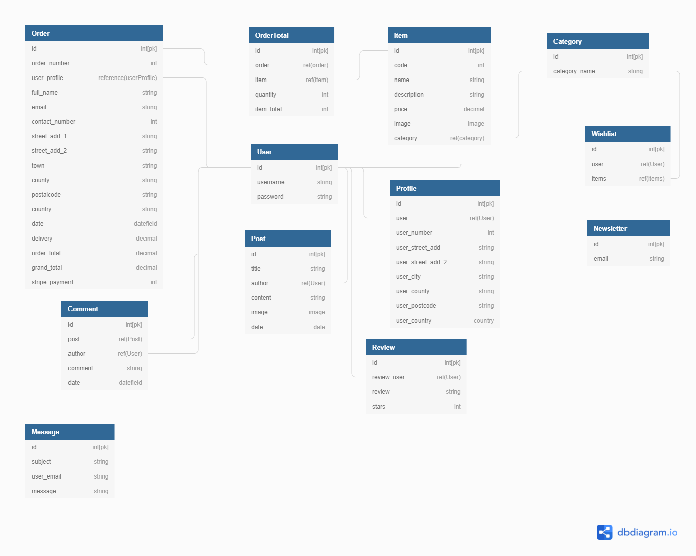
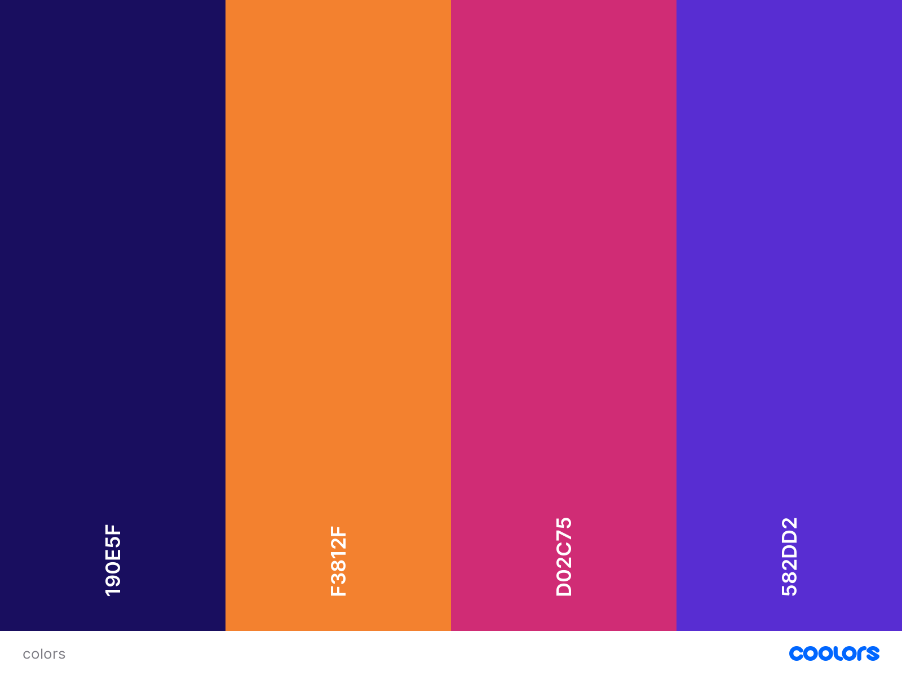

# Dev_fab web Development Service

- This project aims to build a full-stack web application using Django full-stack web framework, HTML, Css3, and javascript.

## Table of Contents.

- [User experience](#user-experience)
  * [User Stories](#user-stories)
  * [WireFrames](#wireframes)
  * [Database models and schema](#database-models-and-schema)
    + [Models](#models)
  * [Design](#design)
    + [Colour scheme](#colour-scheme)
    + [Typography](#typography)
    + [Images](#images)
    + [Icons](#icons)
- [Features](#features)
    + [Homepage App.](#homepage-app)
    + [Service App](#service-app)
    + [Cart App.](#cart-app)
    + [Checkout app.](#checkout-app)
    + [Reviews app.](#reviews-app)
    + [Users app.](#users-app)
    + [Wishlist app.](#wishlist-app)
    + [Blog app.](#blog-app)
- [Testing](#testing)
    + [Testing.](#testing)
- [Technologies used.](#technologies-used)
  * [Languages Used.](#languages-used)
  * [Django, and Django extensions used](#django--and-django-extensions-used)
  * [Frameworks Libraries and Programs.](#frameworks-libraries-and-programs)
  * [Deployment.](#deployment)
    + [Github, Gitpod, Git, Heroku, and Amazon AWS.](#github--gitpod--git--heroku--and-amazon-aws)
    + [Project setup.](#project-setup)
    + [Deployment to Heroku](#deployment-to-heroku)
    + [Amazon AWS](#amazon-aws)
    + [Setting up locally](#setting-up-locally)
- [Credits.](#credits)
  

<small><i><a href='http://ecotrust-canada.github.io/markdown-toc/'>Table of contents generated with markdown-toc</a></i></small>

## User experience

### User Stories

- Customer
  - Website experience
       -  As a customer, I would like to see what service the website is selling.
       - As a customer, I would like to be able to navigate the website easily.
       - As a customer, I would like to see some information about the company.
       - As a customer, I would like to be able to contact the company.

  - Searching for items.
    - As a customer, I would like to see all the products the company sells.
    - As a customer, I would like to be able to search by category.
  
  - Shopping.
    - As a customer, I would like to see the product price and description.
    - As a customer, I would like to be able to add products to my shopping cart.
    - As a customer, I would like to be notified when I complete interactions with the site.
    - As a customer, I would like to be able to edit my shopping cart.
    - As a customer, I would like to be able to checkout easily.
    - As a customer, I would like to receive confirmation of my order.

  - Account.
    - As a customer, I would like to save my details to an account.
    - As a customer, I would like to see my previous order details.
    - As a customer, I would like to leave a review of the company.

- Website owner.
  - As the business owner, I would like to be able to edit and add products easily.
  - As the business owner, I would like to be able to delete products.
  - As the business owner, I would like to have access to an admin section. 
  - As the business owner, I would like my customers to be able to shop on the site easily.

  ### WireFrames

- I've created WireFrames using Balsamiq and have included the links to access them.

  - Phone
    - [Wireframes for phones.](readme-images/wireframes/mobilewireframe.jpg)
  - Tablet
    - [Wireframes for tablets.](readme-images/wireframes/tabletwireframe.png)
  - Desktop
    - [Wireframes for desktops.](readme-images/wireframes/desktopwireframe.png)

    ### Database models and schema

- #### Models
- Users
  - User
    - From Django Allauth containing the username, email, and password.
  - Userprofile
    - Model containing the user's details for future orders.
  - Wishlist
    - Contains a list of items that the user has liked.

- Service
  - Items
    - Contains the service information for each product item.
  - Categories
    - The categories for the service items.

- Customer details.
  - Newsletter Subscribers
    - Contains the email of users who have signed up for the newsletter.
  - Messages.
    - Contains the details of the messages from the contact form.

- Shop
  - Order
    - Contains details of the customer's orders, their details, and the items they've ordered.
  - Orderline item
    - Items for the customer order the quantity and total.

- Blog
  - Post
    - Contains the blog post and details of its author and title.
  - Comments
    - Contains the comments for each post.

- Database Diagram

  - The database diagram shows a list of items in each object and relationships between each object.

    

### Design

- #### Colour scheme

  - My Colour scheme was inspired by my main hero image matching the navy background within the image to be used for the navigation and text colour.
  - I then pick two violet colours for the main background, I decide to use strong colours to create a softer effect.
 

    - 

