# Dev_fab web Development Service

- This project aims to build a full-stack web application using Django full-stack web framework, HTML, Css3, and javascript.

  - This is an e-commerce web app for a fictional Web service Company.

  - The application features e-commerce functionality, payment system using Stripe, user login, confirmation emails, CRUD functionality for Admin to add new items, and an admin section for the administrator to access database record.

  ## Live project

- [View the live project here.](https://devfab.herokuapp.com/)

## Screenshots

  - ### Landing page Home Page.

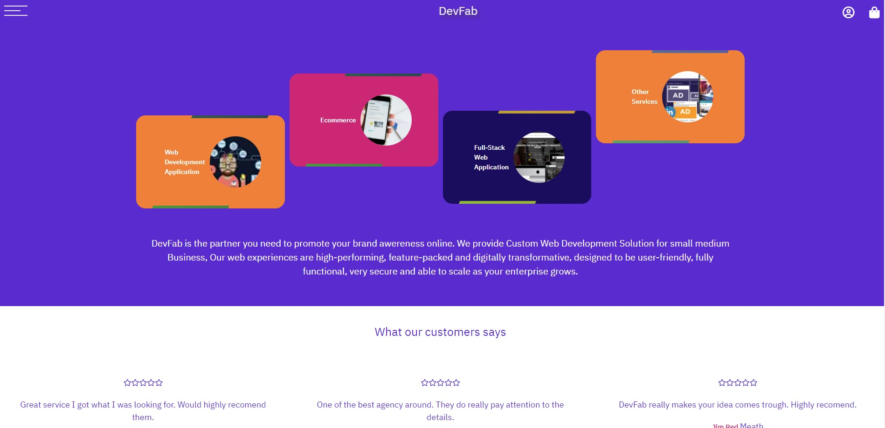

  - ### Landing page Shopping our service.

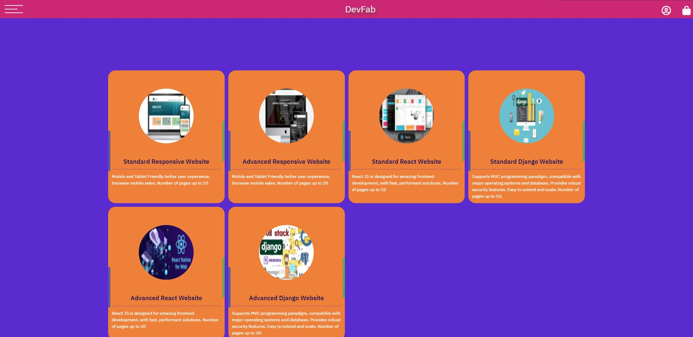

## Table of Contents.

- [User experience](#user-experience)
  * [User Stories](#user-stories)
  * [WireFrames](#wireframes)
  * [Database models and schema](#database-models-and-schema)
    + [Models](#models)
  * [Design](#design)
    + [Colour scheme](#colour-scheme)
    + [Typography](#typography)
    + [Images](#images)
    + [Icons](#icons)
- [Features](#features)
    + [Homepage App.](#homepage-app)
    + [Service App](#service-app)
    + [Bag App.](#bag-app)
    + [Checkout app.](#checkout-app)
    + [Reviews app.](#reviews-app)
    + [Users app.](#users-app)
    

- [Technologies used.](#technologies-used)
  * [Languages Used.](#languages-used)
  * [Django, and Django extensions used](#django--and-django-extensions-used)
  * [Frameworks Libraries and Programs.](#frameworks-libraries-and-programs)
  * [Deployment.](#deployment)
    + [Github, Gitpod, Git, Heroku, and Amazon AWS.](#github--gitpod--git--heroku--and-amazon-aws)
    + [Project setup.](#project-setup)
    + [Deployment to Heroku](#deployment-to-heroku)
    + [Amazon AWS](#amazon-aws)
    + [Setting up locally](#setting-up-locally)
- [Credits.](#credits)
  

<small><i><a href='http://ecotrust-canada.github.io/markdown-toc/'>Table of contents generated with markdown-toc</a></i></small>

## User experience

### User Stories

- Customer
  - Website experience
       -  As a customer, I would like to see what service the website is selling.
       - As a customer, I would like to be able to navigate the website easily.
       - As a customer, I would like to see some information about the company.
       - As a customer, I would like to be able to contact the company.

  - Searching for items.
    - As a customer, I would like to see all the products the company sells.
    - As a customer, I would like to be able to search by category.
  
  - Shopping.
    - As a customer, I would like to see the product price and description.
    - As a customer, I would like to be able to add products to my shopping bag.
    - As a customer, I would like to be notified when I complete interactions with the site.
    - As a customer, I would like to be able to edit my shopping bag.
    - As a customer, I would like to be able to checkout easily.
    - As a customer, I would like to receive confirmation of my order.

  - Account.
    - As a customer, I would like to save my details to an account.
    - As a customer, I would like to see my previous order details.
    - As a customer, I would like to leave a review of the company.

- Website owner.
  - As the business owner, I would like to be able to edit and add products easily.
  - As the business owner, I would like to be able to delete products.
  - As the business owner, I would like to have access to an admin section. 
  - As the business owner, I would like my customers to be able to shop on the site easily.

  ### WireFrames

- I've created WireFrames using Balsamiq and have included the links to access them.

  - Phone
    - [Wireframes for phones.](readme-images/wireframes/mobilewireframe.jpg)
  - Tablet
    - [Wireframes for tablets.](readme-images/wireframes/tabletwireframe.png)
  - Desktop
    - [Wireframes for desktops.](readme-images/wireframes/desktopwireframe.png)

    ### Database models and schema

- #### Models
- Users
  - User
    - From Django Allauth containing the username, email, and password.
  - Userprofile
    - Model containing the user's details for future orders.

- Service
  - Items
    - Contains the service information for each product item.
  - Categories
    - The categories for the service items.

- Customer details.
  - Newsletter Subscribers
    - Contains the email of users who have signed up for the newsletter.
  - Messages.
    - Contains the details of the messages from the contact form.

- Shop
  - Order
    - Contains details of the customer's orders, their details, and the items they've ordered.
  - Orderline item
    - Items for the customer order the quantity and total.

- Database Diagram

  - The database diagram shows a list of items in each object and relationships between each object.

    

### Design

- #### Colour scheme

  - My Colour scheme was inspired by my main hero image matching the navy background within the image to be used for the navigation and text colour.
  - I then pick two violet colours for the main background, I decide to use strong colours to create a softer effect.
 

    - 

    - #### Typography

  - I've chosen the IBM Plex Sans font from google fonts for my site.
  - I've used the one font throughout the website to keep the design consistent.
  - I then used different font weights to add more emphasis to some text, such as headings. 
    - 
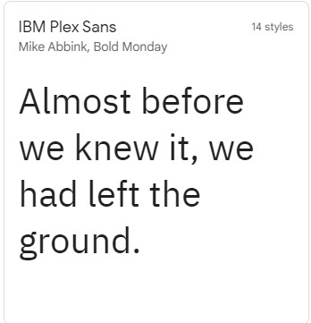

- #### Images 

  - The majority of images I have used were obtained from Unsplash.
  - I've used four main box images on the hero page.
  - I then found images of web service items  which I used to create my stock items for the e-commerce part of the site.    

- #### Icons 
  - I've used icons in this project for the navigation on mobile sites and the social media links in the footer.
  - All icons have been obtained from Font Awsome.

  
  ## Features
  
- #### Homepage App.

    - Home Page.
        - Upon opening the site the user is greeted with the main home page section that defines the site as a web service store. 

            - 

        
    - Interactive Nav

        - The site then contains the navigation section accessed by clicking on the hamburger icon.
        - The navigation also has an opaque background and a slight background blur to give it a modern glass feel.

            - 
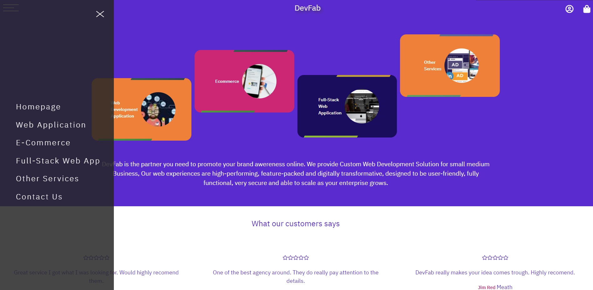

        
    - Review Section.

        - The review section containing users review whit rating and comments.
        - The user can click on the button to access all the reviews and can add or edit if is logged in.
            - 
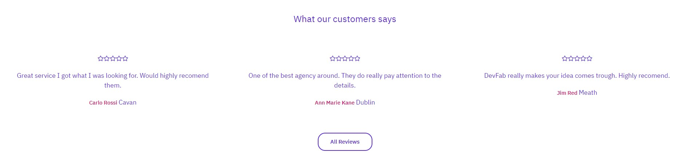

        
    - Newsletter

        - The homepage contains a section where the user can sign up for a newsletter.
        - Their email address will then be stored in the database and they will be sent a confirmation email.
            - 

    
- #### Service App

    - All Service Category

        - The all service view shows all the category available in the store.
        - Then when user click on the single service categegory will redirect to the specif category.

          - 
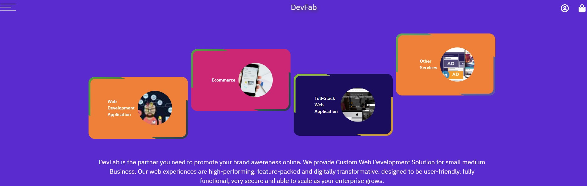

    - Service Category
        - The user can then view the items available for the specific category selected.

          - 
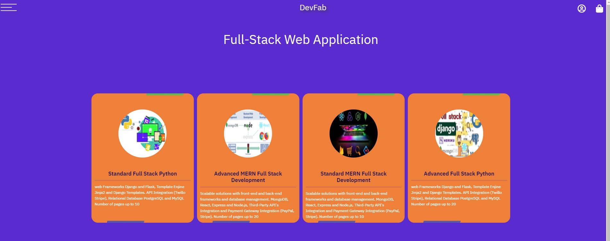
    

    - Item page.
        - The item page then consists of the items details with a quantity selector and an add to bag button.
        - It also has a link back to the items page so the user can continue shopping.

          -  
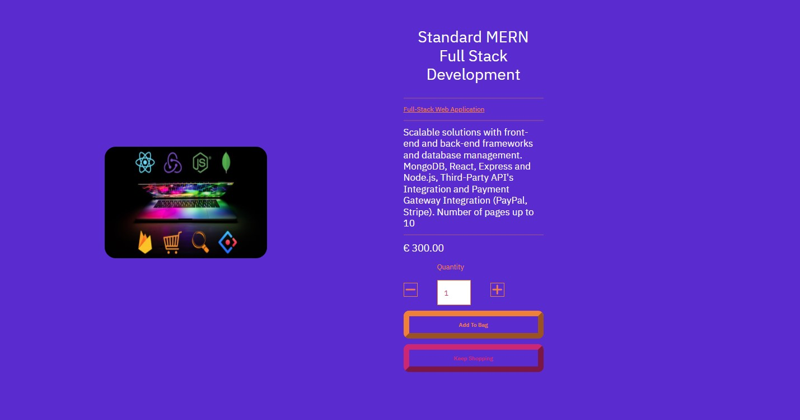
   

    - #### Bag App.
    - Add to Bag.
        - The user has the option to add items to the bag from the item page.
        - When the user clicks this button the item will be placed into the bag. 
        - A message showing that the item has been placed in the bag with a list of bag items.
        - The bag navigation item will then show a button showing the number of items in the user's cart.
            -  
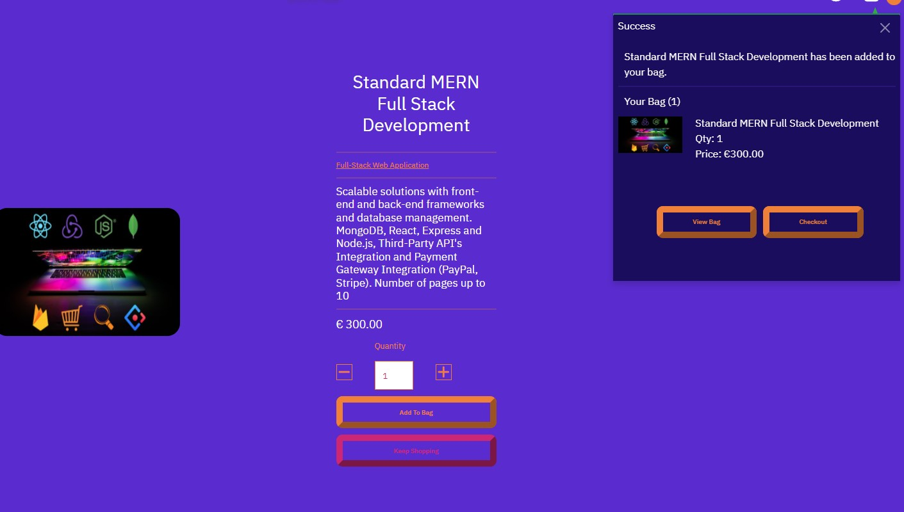

    
    - Bag Page.
        - The bag page shows the users the items in their bag.
        - The user can then adjust the quantity of each item, or delete the item from the bag.
        - The bag also shows the total price the user.
        - If the user wishes to continue shopping there is a link to the items page.
            -  
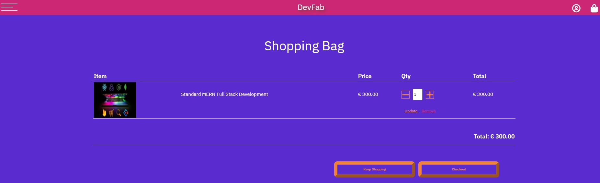

- #### Checkout app.
    - Checkout page.
        - Once the user decide to buy can go to the checkout page.
        - Here they are shown the checkout form and a list of their bag items with total amount.
            -  
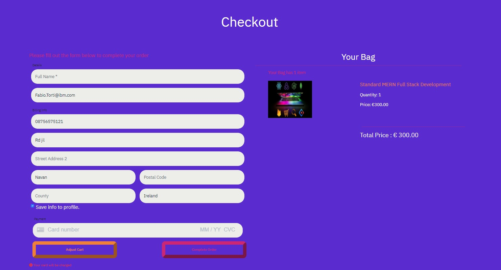

    
    - Order confirmation page.
        - After the order has been confirmed the user is then directed to the order confirmation page.
        - A confirmation email will also be sent to the user.
            -  
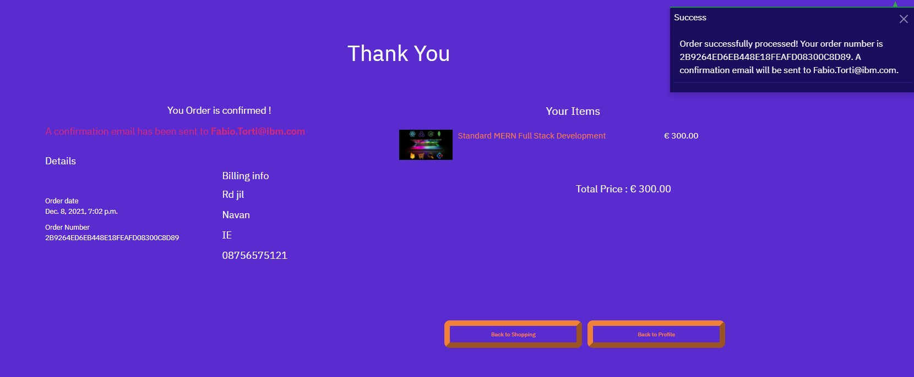

  ## Technologies used.

- The application was built on the Django full-stack framework.
- Each app then has a views.py, urls.py file to create the pages it needs.
- Then to create the database models a models.py file is used.
- If there are any forms needed they are then created in the forms.py file.
- Stripe has been used for the payment function of the e-commerce shop.

### Languages Used.

- [HTML5](https://en.wikipedia.org/wiki/HTML5)

  - HTML5 was used to create the content and base of each page.

- [CSS3](https://en.wikipedia.org/wiki/CSS)

  - CSS3 was used to then style the page and make it responsive through media queries, and interactive through using CSS transitions.

- [javaScript](https://en.wikipedia.org/wiki/JavaScript)
  - javaScript was used throughout the website to make the site interactive.

- [Python](https://en.wikipedia.org/wiki/Python_(programming_language))
  - Python was used to build the backend functionality of the web app.
 

 ### Django and Django extensions used

- [Django](https://www.djangoproject.com/)
  - Django was used to create the project.

- [Django Allauth](https://django-allauth.readthedocs.io/en/latest/)
  - Django allauth was used to create the user sign-in function for the site.

- [Django Allauth Social Login](https://django-allauth.readthedocs.io/en/latest/providers.html/)
  - Django allauth Social login function was used to allow the user to sign up, or log in with Facebook.

- [Django Countries](https://pypi.org/project/django-countries/)
  - Django Countries was used for the countries select field in the order form.

- [Django Crispy Forms](https://django-crispy-forms.readthedocs.io/en/latest/)
  - Django Crispy Forms were used to utilise the bootstrap form classes.

- [Django Coverage](https://pypi.org/project/django-coverage/)

  - Django Coverage was used when testing to form a testing report.

### Frameworks Libraries and Programs.

- [Stripe](https://stripe.com/ie)

  - CStripe has been used for the payment section of the site.

- [Heroku](https://signup.heroku.com/)

  - Heroku was used to deploy the website.
[Bootstrap 5](https://getbootstrap.com/)

  - Bootstrap 5 was used for its grid system and its form inputs and its helper classes.

- [Quick Database Diagrams](https://www.quickdatabasediagrams.com/)

  - I used quick database diagrams to make a diagram of my database schema.
  
- [Github](https://github.com/)

  - Github was used to create and store the project repository.
- [Balsamiq](https://balsamiq.com/)

  - Balsamiq was used to create Wireframes for the project during the initial planning stage.

- [Am I responsive](http://ami.responsivedesign.is/)

  - Am I responsive was used to taking screenshots of the page at different screen sizes.