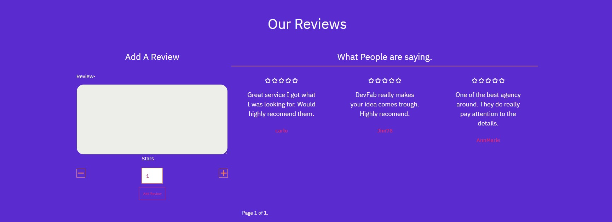
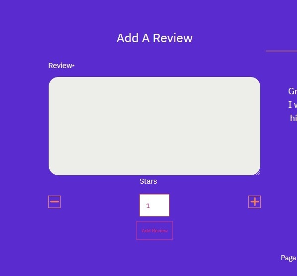
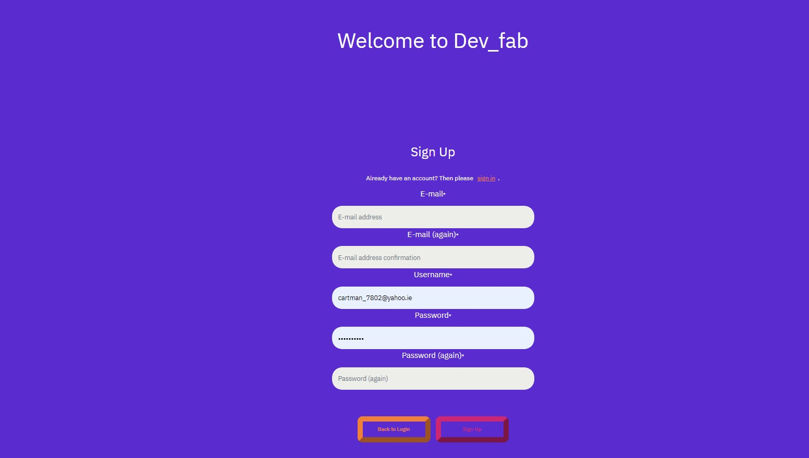
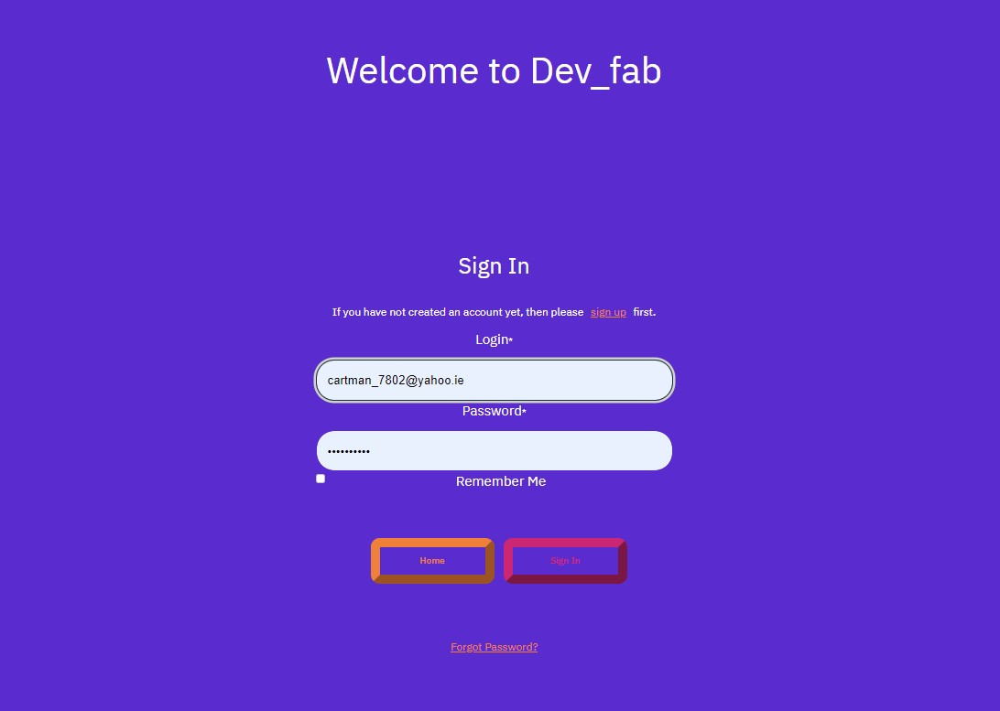
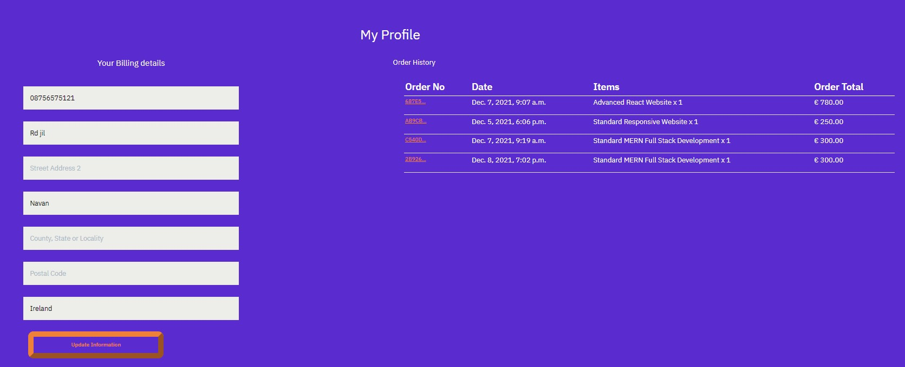
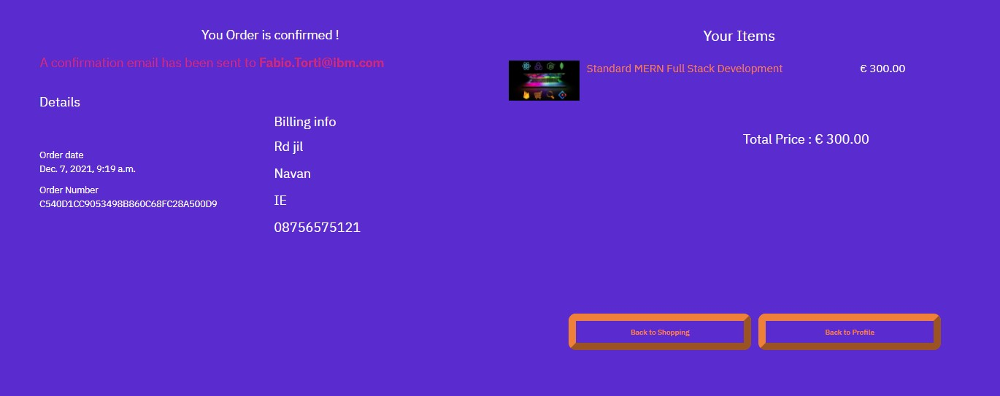

# Dev_fab web Development Service

- This project aims to build a full-stack web application using Django full-stack web framework, HTML, Css3, and javascript.

  - This is an e-commerce web app for a fictional Web service Company.

  - The application features e-commerce functionality, payment system using Stripe, user login, confirmation emails, CRUD functionality for Admin to add new items, and an admin section for the administrator to access database record.


  ## Live project


- [View the live project here.](https://devfab.herokuapp.com/)

## Screenshots

  - ### Landing page Home Page.

<div align="center"></div>

  - ### Landing page Shopping our service.

<div align="center"></div>

## Table of Contents.

- [User experience](#user-experience)
  * [User Stories](#user-stories)
  * [WireFrames](#wireframes)
  * [Database models and schema](#database-models-and-schema)
    + [Models](#models)
  * [Design](#design)
    + [Colour scheme](#colour-scheme)
    + [Typography](#typography)
    + [Images](#images)
    + [Icons](#icons)
- [Features](#features)
    + [Homepage App.](#homepage-app)
    + [Service App](#service-app)
    + [Bag App.](#bag-app)
    + [Checkout app.](#checkout-app)
    + [Reviews app.](#reviews-app)
    + [Profile app.](#profile-app)
  - [Testing](#testing)  

- [Technologies used.](#technologies-used)
  * [Languages Used.](#languages-used)
  * [Django, and Django extensions used](#django--and-django-extensions-used)
  * [Frameworks Libraries and Programs.](#frameworks-libraries-and-programs)
  * [Deployment.](#deployment)
- [Credits.](#credits)
  

<small><i><a href='http://ecotrust-canada.github.io/markdown-toc/'>Table of contents generated with markdown-toc</a></i></small>


## User experience

### User Stories

- Customer
  - Website experience
       -  As a customer, I would like to see what service the website is selling.
       - As a customer, I would like to be able to navigate the website easily.
       - As a customer, I would like to see some information about the company.
       - As a customer, I would like to be able to contact the company.
  
  - Shopping.
    - As a customer, I would like to see the product price and description.
    - As a customer, I would like to be able to add products to my shopping bag.
    - As a customer, I would like to be notified when I complete interactions with the site.
    - As a customer, I would like to be able to edit my shopping bag.
    - As a customer, I would like to be able to checkout easily.
    - As a customer, I would like to receive confirmation of my order.

  - Account.
    - As a customer, I would like to save my details to an account.
    - As a customer, I would like to see my previous order details.
    - As a customer, I would like to leave a review of the company.

- Website owner.
  - As the business owner, I would like to be able to edit and add products easily.
  - As the business owner, I would like to be able to delete products.
  - As the business owner, I would like to have access to an admin section. 
  - As the business owner, I would like my customers to be able to shop on the site easily.

  ### WireFrames

- I've created WireFrames using Balsamiq and have included the links to access them.

  - Phone
    - [Wireframes for phones.](readme-images/wireframes/mobilewireframe.jpg)
  - Tablet
    - [Wireframes for tablets.](readme-images/wireframes/tabletwireframe.png)
  - Desktop
    - [Wireframes for desktops.](readme-images/wireframes/desktopwireframe.png)

    ### Database models and schema

- #### Models
- Users
  - User
    - From Django Allauth containing the username, email, and password.
  - Userprofile
    - Model containing the user's details for future orders.

- Service
  - Items
    - Contains the service information for each product item.
  - Categories
    - The categories for the service items.

- Customer details.
  - Newsletter Subscribers
    - Contains the email of users who have signed up for the newsletter.
  - Messages.
    - Contains the details of the messages from the contact form.

- Shop
  - Order
    - Contains details of the customer's orders, their details, and the items they've ordered.
  - Orderline item
    - Items for the customer order the quantity and total.


- Database Diagram

  - The database diagram shows a list of items in each object and relationships between each object.

    <div align="center"></div>

### Design

- #### Colour scheme

  - My Colour scheme was inspired by my main hero image matching the navy background within the image to be used for the navigation and text colour.
  - I then pick two violet colours for the main background, I decide to use strong colours to create a softer effect.
 

    - <p align="center"></p>

    - #### Typography

  - I've chosen the IBM Plex Sans font from google fonts for my site.
  - I've used the one font throughout the website to keep the design consistent.
  - I then used different font weights to add more emphasis to some text, such as headings. 
    - <p align="center"></p>

- #### Images 

  - The majority of images I have used were obtained from Unsplash.
  - I've used four main box images on the hero page.
  - I then found images of web service items  which I used to create my stock items for the e-commerce part of the site.    

- #### Icons 
  - I've used icons in this project for the navigation on mobile sites and the social media links in the footer.
  - All icons have been obtained from Font Awsome.

  
  ## Features
  
- #### Homepage App.

    - Home Page.
        - Upon opening the site the user is greeted with the main home page section that defines the site as a web service store. 

            - <p align="center"></p>
        
    - Interactive Nav

        - The site then contains the navigation section accessed by clicking on the hamburger icon.
        - The navigation also has an opaque background and a slight background blur to give it a modern glass feel.


            - <p align="center"></p>
        
    - Review Section.

        - The review section containing users review whit rating and comments.
        - The user can click on the button to access all the reviews and can add or edit if is logged in.
            - <p align="center"></p>
        
    - Newsletter

        - The homepage contains a section where the user can sign up for a newsletter.
        - Their email address will then be stored in the database and they will be sent a confirmation email.
            - <p align="center"></p>
    
- #### Service App

    - All Service Category

        - The all service view shows all the category available in the store.
        - Then when user click on the single service categegory will redirect to the specif category.

          - <p align="center"></p>

    - Service Category
        - The user can then view the items available for the specific category selected.

          - <p align="center"></p>    

    - Item page.
        - The item page then consists of the items details with a quantity selector and an add to bag button.
        - It also has a link back to the items page so the user can continue shopping.

          -  <p align="center"></p>   


    - #### Bag App.
    - Add to Bag.
        - The user has the option to add items to the bag from the item page.
        - When the user clicks this button the item will be placed into the bag. 
        - A message showing that the item has been placed in the bag with a list of bag items.
        - The bag navigation item will then show a button showing the number of items in the user's cart.
            -  <p align="center"></p>
    
    - Bag Page.
        - The bag page shows the users the items in their bag.
        - The user can then adjust the quantity of each item, or delete the item from the bag.
        - The bag also shows the total price the user.
        - If the user wishes to continue shopping there is a link to the items page.
            -  <p align="center"></p>


- #### Checkout app.
    - Checkout page.
        - Once the user decide to buy can go to the checkout page.
        - Here they are shown the checkout form and a list of their bag items with total amount.
            -  <p align="center"></p>
    
    - Order confirmation page.
        - After the order has been confirmed the user is then directed to the order confirmation page.
        - A confirmation email will also be sent to the user.
            -  <p align="center"></p>


- #### Reviews app.
    - Reviews page.
        - From the reviews section in the user can navigate to the review page.
        - In the revie page they can see all the reviews left by other users.
        - If they aren't logged in they will see a notification to log in or sign up to leave a review.
            - <p align="center"></p>
        
        - If the user is logged in they will see a form section to leave a review.
        - Once the form is submitted it will appear in the reviews section with their username.
        - If the current user is the owner of a review they will be given the option to edit or delete the review.

            -  <p align="center"></p>


- #### Profile app.
   
    - Signup 
        - If the user isn't signed up they can click the signup link and be brought to the signup page.
        - Than they can fill in the signup form to signup.
        - The page also has a link to the login in case a user that has already been signed up.
            -  <p align="center"></p>
    
    - Login
        - User can now use the login feature.
        - They can fill out their login details.
        - There is also a link to the signin form in case a user has navigated here who hasn't signed up yet.
            -  <p align="center"></p>
    
    - Profile page.
        - The user's profile page will hold the users shipping details for ease of shopping in future.
        - It also has a reference to the users past orders.
            -  <p align="center"></p>

        - When the user clicks on the order number, they are brought to that previous order page where they can see details of the previous order.
            -  <p align="center"></p>

## Testing

- #### Testing.
  - The testing section for this site is located at the following link.
    - [Testing file](TESTING.md)

  ## Technologies used.

- The application was built on the Django full-stack framework.
- Each app then has a views.py, urls.py file to create the pages it needs.
- Then to create the database models a models.py file is used.
- If there are any forms needed they are then created in the forms.py file.
- Stripe has been used for the payment function of the e-commerce shop.


### Languages Used.

- [HTML5](https://en.wikipedia.org/wiki/HTML5)

  - HTML5 was used to create the content and base of each page.

- [CSS3](https://en.wikipedia.org/wiki/CSS)

  - CSS3 was used to then style the page and make it responsive through media queries, and interactive through using CSS transitions.

- [javaScript](https://en.wikipedia.org/wiki/JavaScript)
  - javaScript was used throughout the website to make the site interactive.

- [Python](https://en.wikipedia.org/wiki/Python_(programming_language))
  - Python was used to build the backend functionality of the web app.
 

 ### Django and Django extensions used

- [Django](https://www.djangoproject.com/)
  - Django was used to create the project.

- [Django Allauth](https://django-allauth.readthedocs.io/en/latest/)
  - Django allauth was used to create the user sign-in function for the site.

- [Django Allauth Social Login](https://django-allauth.readthedocs.io/en/latest/providers.html/)
  - Django allauth Social login function was used to allow the user to sign up, or log in with Facebook.

- [Django Countries](https://pypi.org/project/django-countries/)
  - Django Countries was used for the countries select field in the order form.

- [Django Crispy Forms](https://django-crispy-forms.readthedocs.io/en/latest/)
  - Django Crispy Forms were used to utilise the bootstrap form classes.

- [Django Coverage](https://pypi.org/project/django-coverage/)

  - Django Coverage was used when testing to form a testing report.


### Frameworks Libraries and Programs.

- [Stripe](https://stripe.com/ie)

  - CStripe has been used for the payment section of the site.

- [Heroku](https://signup.heroku.com/)

  - Heroku was used to deploy the website.
[Bootstrap 5](https://getbootstrap.com/)

  - Bootstrap 5 was used for its grid system and its form inputs and its helper classes.

- [Quick Database Diagrams](https://www.quickdatabasediagrams.com/)

  - I used quick database diagrams to make a diagram of my database schema.
  
- [Github](https://github.com/)

  - Github was used to create and store the project repository.
- [Balsamiq](https://balsamiq.com/)

  - Balsamiq was used to create Wireframes for the project during the initial planning stage.

- [Am I responsive](http://ami.responsivedesign.is/)

  - Am I responsive was used to taking screenshots of the page at different screen sizes.


### Deployment.

This project was developed using the [Python virtulal environment]() at the begin and following with Visual Studio Code, committed to git and pushed to GitHub using the built-in function within git.


**How to run this project locally**

To clone this project into Gitpod you will need:

1. A GitHub account. [Create a Github account here](https://github.com/)
2. Use the Chrome browser

Then follow these steps:

1. Install the [Gitpod Browser Extensions for Chrome](https://www.gitpod.io/docs/browser-extension/)
2. After installation, restart the browser
3. Log into [Gitpod](https://gitpod.com/) with your Gitpod account.
4. Navigate to the [Project GitHub repository](https://github.com/cartman1978/dev_fab-service)
5. Click the green "Gitpod" button in the top right corner of the repository
6. This will trigger a new Gitpod workspace to be created from the code in GitHub where you can work locally.

To work on the project code within a local IDE such as VSCode, Pycharm etc:

1. Follow this link to the [project GitHub repository](https://github.com/cartman1978/dev_fab-service).
2. Under the repository name, click "Clone or download".
3. In the Clone with HTTPs section, copy the clone URL for the repository.
4. In your local IDE open the terminal.
5. Change the current working directory to the location where you want the cloned directory to be made.
6. Type `git clone`, and then paste the URL you copied in Step 3.

```
git clone https://github.com/USERNAME/REPOSITORY
```

1. Press Enter. Your local clone will be created.

Further reading and troubleshooting on cloning a repository from GitHub [here](https://help.github.com/en/articles/cloning-a-repository).

  - To commit I added the file to the staging area with the 

    ```
        git add <filename>
    ```

    ```
        git commit -m "<commit message>"
    ```

    ```
        git push
    ```

- #### Deployment to Heroku

  Once the app was ready I deployed it to Heroku by following these steps.

- **Create an app on the Heroku website.**

  - Firstly I clicked on the new button.
  - Then I clicked on the create a new app.
  - I then gave my app a name and chose my current region.
  - I then selected create app.

- **Set up Postgres Database**

  - Heroku

    - In the app resources section I searched for Postgres
    - I then chose to add to the project and, choosing the free plan.
    - To use Postgres we need to install 2 dependencies.
      - dj_database_url
      - psycopg2

  - **In Project.**

    - I first installed the two packages needed 

    - ``` 
          pip install dj_database_url
      ```

      -

      ```
          pip install psycopg2_binary
      ```

    - I then made sure to add them to the requirements.txt file
      -

        ```
      pip freeze > requirements.txt
        ```

    - Then in settings.py I imported dj_database_url

    - ``` python
      import dj_database_url
      ```

    - I then commented out the current database settings.

    - I then replaced it with the settings for the Postgres database.
      -

        ``` python
          DATABASES = {
              'default': dj_database_url.parse('DATABASE_URL')
          }
        ```

    - Get your database URL from your app config settings. (I haven't shown it above as its and environmental variable and shouldn't be shown in version control)

    - Once this is set up we need to migrate our models to the new database.

    - ``` 
          python manage.py migrate
      ```

    - I then used the fixtures I had to create earlier to add the stock into the new database. 

    - ```
          python manage.py loaddata categories
          python manage.py loaddata stock
      ```

    - Once this was done I then created a superuser.

    - ```
          python manage.py createsuperuser
      ```

    - I then committed my changes making sure to remove my database URL beforehand so it isn't saved in version control.

    - I then created an if-else statement in the settings.py to use Postgres if the DATABASE_URL variable is available and if not use the default database

    - ``` python
          if "DATABASE_URL" in os.environ:
              DATABASES = {
                  "default": dj_database_url.parse(os.environ.get('DATABASE_URL'))
              }
          else:
              DATABASES = {
                  'default': {
                      'ENGINE': 'django.db.backends.sqlite3',
                      'NAME': BASE_DIR / 'db.sqlite3',
                  }
              }
      ```

    -The Postgres database is now ready for use.

  - **Gunicorn**

    - For our app to work we need to install Greenunicorn.

    - To install 

    - ```
      pip install Gunicorn
      ```

    - We then need to create a Procfile to let Heroku know how to run the app.
      -

        ``` 
          touch Procfile
        ```

    - Then in our Procfile place the following code.
      -

        ```
          web: gunicorn <app name>.wsgi:application
        ```

  - **Heroku in the command line.**

    - I then logged into Heroku using the terminal.
      -

        ```
          heroku login -i
        ```

    - Then I temporarily disabled the static files until they have been set up on Amazon Aws.
      -

        ```
          heroku config:set DISABLE_COLLECTSTATIC=1 --app <app name>
        ```

        - Use the --app command if you have more than one Heroku app.

    - Then in settings I added Heroku into allowed hosts, and localhost so my project can still be run locally.
      -

        ``` python
          ALLOWED_HOSTS = ["<heroku app name>.herokuapp.com", "localhost"]
        ```

    - My changes were then committed to Github.

    - Then I set up pushing to Heroku
      -

        ```
          heroku git:remote -a <heroku app name>
        ```

    - Then we push the project to Heroku
      -

        ```
          git push heroku master
        ```

    - Heroku will now build your app.

  - **Heroku Website**

    - I then connected my app to GitHub by opening the Deploy section.
    - I then searched for my repository.
    - Once found I connected and then enabled Automatic Deploys
    - This now means that any changes pushed to GitHub will be automatically pushed to Heroku as well.

- #### Amazon AWS

  - Amazon AWS was used to store both static files and media files.

  - Firstly I created an AWS account and worked through the sign-up process. Once my account was set up I was able to set my project up on AWS.

  - **Create a bucket.**

    - Create the bucket

      - First thing was to create a new bucket on the AWS S£ service.
      - From the main dashboard search for S£ and then click to get started.
      - Click on the Create bucket button.
      - Give the bucket a name and select your region.
      - Then uncheck the block public access and acknowledge that the bucket will now be public.
      - Then click create bucket.

    - Bucket settings.

      - Properties

        - Navigate to the bucket properties settings.
        - Turn on static website hosting.
        - In the index and error add index.html and error.html.
        - Click Save.

      - Permissions

        - Click on the buckets Permissions tabs.

        - Firstly paste in the following cors config.

        - ```
          [
              {
                  "AllowedHeaders": [
                      "Authorization"
                  ],
                  "AllowedMethods": [
                      "GET"
                  ],
                  "AllowedOrigins": [
                      "*"
                  ],
                  "ExposeHeaders": []
              }
              ]
          ```

        - Then in the bucket policy tap, click on generate policy.

        - Policy

        - Select S3 bucket policy

        - Add * to the principal field to select all principals

        - Set the action to get object.

        - Paste in your ARN which is available on the previous page.

        - Click, add statement

        - Then click, generate policy.

        - Now copy and paste your new policy into the bucket policy.

        - Add /* onto the end of the resources key

        - Click Save.

      - Access control list

      - In the access control list tab set the list objects permission to everyone.

   - **Create a User.**

     - To create a user for the bucket we need to use another Amazon service.
     - Back in the main dashboard search for IAM and select it.

     - Create a Group.
       - Firstly we need to create a group to put our user in.
       - Click create a new group and name it.
       - Click through to the end and save the group.
       - Create a policy.
         - In our group click, policy and then, create policy.
         - Select the JSON tab and then import managed policies.
         - Search S3 and select AmazonS3FullAccess and import.
         - In the resources section paste in our arn from before.
         - click through to review the policy.
         - Fill in name and description and then click generate policy.
       - Back in your group click permission and then attach the policy.
       - Find the policy you've just created and attach it.

     - Create the User.
       - Select Users from the sidebar and then click, add user.
       - Create a user name and select programmatic access then click next.
       - Then select your group to add your user to.
       - Click through to the end and then click create user.
       - ** Make sure to now download the CSV file as it contains the users keys needed to access from our app.**

  - **Connecting to Django**

    - Once our AWS has been set up we now need to connect it to Django.

    - Firstly two packages are needed.

      - boto 3
      - Django storages

    - Firstly install these packages.
      -

        ```
          pip install boto3
          pip install django-storages
        ```

    - Then add to our requirements.
      -

        ```
          pip3 freeze > requirements.txt
        ```

    - We then add storages into our installed apps in settings.py

    - We then add the following settings to our settings.py

    - We create an environmental variable to only run this code when on Heroku. "USE_AWS"
      -

        ``` python
            if "USE_AWS" in os.environ:
      
                # Bucket Config
                AWS_STORAGE_BUCKET_NAME = '<bucket name>'
                AWS_S3_REGION_NAME = '<your region>'
                AWS_ACCESS_KEY_ID = os.environ.get('AWS_ACCESS_KEY_ID')
                AWS_SECRET_ACCESS_KEY = os.environ.get('AWS_SECRET_ACCESS_KEY')
                AWS_S3_CUSTOM_DOMAIN = f'{AWS_STORAGE_BUCKET_NAME}.s3.amazonaws.com'
      
                # static and media file storage
                STATICFILES_STORAGE = 'custom_storages.StaticStorage'
                STATICFILES_LOCATION = 'static'
                DEFAULT_FILE_STORAGE = 'custom_storages.MediaStorage'
                MEDIAFILES_LOCATION = 'media'
      
                # Override static and media URLs in production
                STATIC_URL = f'https://{AWS_S3_CUSTOM_DOMAIN}/{STATICFILES_LOCATION}/'
                MEDIA_URL = f'https://{AWS_S3_CUSTOM_DOMAIN}/{MEDIAFILES_LOCATION}/'
        ```

    - Then back in Heroku we click the settings and reveal config vars.

    - Then set up the environmental variables needed.

    - We then create a custom_storages.py to tell Django that in production we want to use s3 to store our static and media files.

    - We Firstly need to import S3Boto3Storage.

    - then we set up our new classes to tell Django where to store the files.
      -

        ``` python
          class StaticStorage(S3Boto3Storage):
              location = settings.STATICFILES_LOCATION
        ```


            class MediaStorage(S3Boto3Storage):
                location = settings.MEDIAFILES_LOCATION
        ```
    - Once all the settings are done we can now push to GitHub and Heroku.

  - **Add our media to AWS.**

    - The final step is to add our media to AWS.
    - In your bucket create a new folder called media.
    - Select upload and add your image files.
    - Then select to grant public access.
    - And then upload the files.

#### Setting up locally

  - - Then extract the zip file to your repository.

    - Alternatively, you can clone it into your repository using the following command.

      - ```
            git clone https://github.com/cartman1978/dev_fab-service.git
        ```

    - Once you have created the repository you can now download the requirements by running the following command.

      - 

      ```
            pip install -r requirements.txt
      ```

    - You must then set up the following environment variables to use the full functionality of the site.

      - DANGO_SECRET_KEY = your secret key.
      - STRIPE_PUBLIC_KEY = your stripe public key.
      - STRIPE_SECRET_KEY = your stripe secret key.
      - STRIPE_WH_SECRET = your stripe webhook secret.
      - IN_DEVELOPMENT = True

      - Your stripe variables can be found on your stripe dashboard.
      - You can generate a Django secret key here. [Django Secret Key Generator](https://miniwebtool.com/django-secret-key-generator/)

    - You will then need to migrate the database models to set up your database.

    - - Check first

        ```
            python manage.py makemigrations --dry-run
        ```

       - Then make migrations.

         ```
             python manage.py makemigrations
         ```

       - Check the migration plan

         ```
             python manage.py migrate --plan
         ```

       - Then finally migrate

         ```
             python manage.py migrate
         ```

     - Then create your superuser to access the admin section.
       -

       ```
           python manage.py createsuperuser
       ```

       - Following the prompts.

    - Once these steps have been followed you can then run the project by using the following command.

      - ```
            python manage.py runserver
        ```
