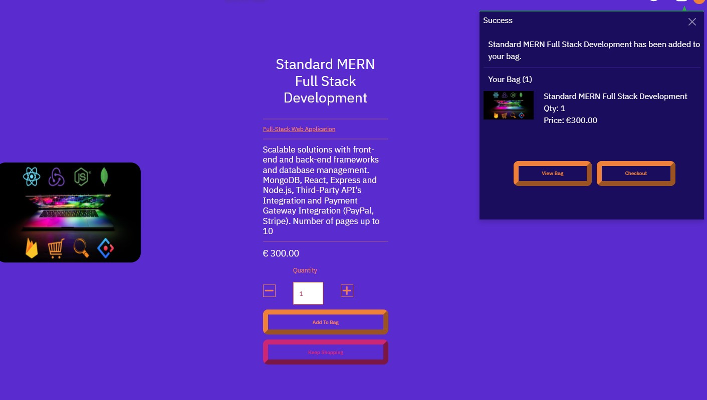

## Testing

Main [README.md](README.md)

#### Validation

- [W3C CSS validation](https://jigsaw.w3.org/css-validator/)

- [W3C Markup Validation](https://validator.w3.org/)
  
  - The developer used the **W3C CSS Validation Service** and **W3C Markup Validation Service** to check the validity of the website code.
  
- [JShint](https://jshint.com/) check the validity of the javascript code.

- [PEP8](http://pep8online.com/) check the python code

  


##### Error during the validation

**HTML**

I got an error about closing li tag missing the rest had no major issues


**CSS**

I got an error about multiple id used which I replaced with classes.


**User Stories testing:**

- As a customer, I would like to be able to checkout easily.
  - From the home page user can add item to the bag
  - The message confirm action and gives the option to checkout directly.



- As a shopper View  a list of products so that I can Select  some to purchase.
  - each product is showed by a card with all the info about it
  - each card is clickable and linked to the product details page


- As a customer, I would like to be able to edit my shopping bag.

  - From the bag page can edit the quantity of a particular item.
  - User can also delete an item if they wish to.

  

- As the website owner, I would like to be able to edit and add products easily.
  - The superuser can add products from the admin section of the site.
  - They can also access to the service control page on the front end of the site.


  

  

**General Testing**

* Tested all internal links within the pages.
* Tested all buttons work.
* Tested the responsive behavior of images and text on desktops, laptops, notebooks, various smartphones.
* Reduce and expand the width of the window to verify that each line of text behaves the way expected and that the text arrangement looks good on all device widths.

**Navbar**

- Click on each navigation menu item and verify that it links to the correct page.
- Change the screen size from desktop to tablet and mobile to verify that the navigation bar is responsive.
- Tested the logo linked back to the home page on all pages.

**Forms**

- Try to submit the empty form and verify that an error message about the required fields appears
- Try to submit the form with an invalid email address and verify that a relevant error message appears
- Try to submit the form with all inputs valid and verify that a success message appears.
- Try to to submit the form with all inputs valid to verify the emailJS works and I receive the template.
- Reduce and expand the width of the window to verify that the form display behaves and centers the way expected and that it looks good on all device widths.

#### Bug

- Posting Data in the Bag.
    - During the development I had an issue send the post data while adding service to the bag;
     -
        ``` 
        Error "No reverse Match at /bag/add
           
        ```

  -  I researched the issue and on stack overflow found the following solution which fixed the issue by placing 
    -
        ``` 
        add {{request.path}} inside value=""
           
        ```

